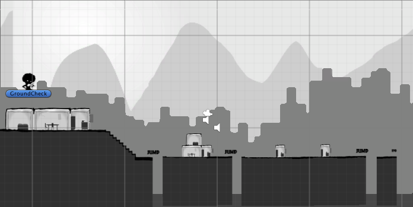
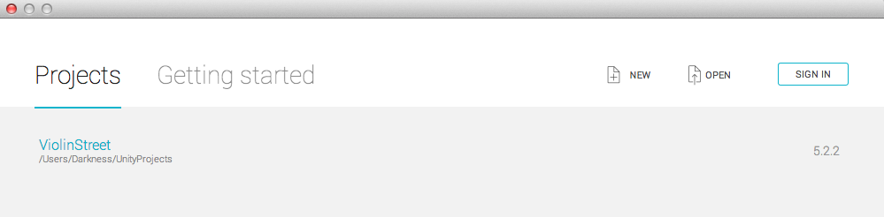

# Wind Strings



A open source mobile game where the player controls a character listening a music rhythm. The character walk througth the periphery streets playing their violin. Strongly inspired in games like **Patapon** and **Beat Buddy**.

> **Obs:** The idea of this game was started in a GameJam on 2015-10-30 during 48hrs!!

## Usage/Contribute

This project was created with [Unity3D](https://unity3d.com) using the 2D perspective. This project contains development versions, and your contribution will be amazing to us!!

If you want test releases, checkout a git **tag** following the steps below.

### 1.  Clone this repo

```bash
git clone git@github.com:mfdeveloper/ViolinStreet.git
```
### 2. Create a new branch and checkout a tag, using command shell or a some git gui. The current releases are:

  #### Releases

  - **v0.1** - Base structure to create 2D platform infinity running games.
  - **v0.2** - Playlable prototype presented in GameJam

  #### Tags

  - **v0.3-dev** - A totally new structure using a [MetronomePro](https://assetstore.unity.com/packages/tools/audio/metronome-pro-79054) asset store package

```bash
git checkout -b playlable_demo v0.2
```
> In this command, the branch ``` playlable_demo ``` will be created from ``` v0.2 ``` tag version.

### 3. Open the project on **Unity3D version 5+** engine in ` File -> Open Project `. The dialog below will be open. Click in ` Open ` button.



### 4. You will see a screen like that. Click on ` Play ` button, enjoy and contribute!!


## Mobile test/development

### Android

Setup a android environment like described in Unity oficial documentation here: [Android environment setup](https://docs.unity3d.com/Manual/android-sdksetup.html)

#### Unity Remote

- Follow the steps described in oficial Unity documentation: **[Unity Remote](https://docs.unity3d.com/Manual/UnityRemote5.html)**. If don't works, follow the steps described in comments of Unity forum answers: [Unity Remote for Android not working (solution)](https://answers.unity.com/questions/198853/unity-remote-for-android-not-working-solution.html)

- If you are using **Windows**, don't forget that install the [Google USB Driver](https://developer.android.com/studio/run/win-usb) with [Android SDK Manager](https://developer.android.com/studio/intro/update.html#sdk-manager)

#### Android emulator

If you wish use an Android emulator to test/develop, try the steps below:

1. Set the environment variable: `$ANDROID_AVD_HOME` to a directory that store your AVD's (commonly _/home/your-user/.android/avd_)

2. Starts your emulator using [Android Studio](https://developer.android.com/studio) or from command line: [Start the emulator from the command line](https://developer.android.com/studio/run/emulator-commandline)

3. Installs the [Unity Remote app](https://play.google.com/store/apps/details?id=com.unity3d.genericremote&hl=en) `.apk` from Google Play. You can download it using a Chrome Extension (like [APK Downloader]((https://apk.support/apk-downloader))), and install on emulator with [adb](https://developer.android.com/studio/command-line/adb):

    ```bash
    adb install unity-remote.apk
    ```

4. On Unity, open menu `File => Build Settings`, select platform **Android** and check if `Run device` dropdown shows your emulator (commonly called: `Google Android SDK...emulator-5554`)

5. Closes the `Build Settings` window, select **Remote** screen size on `Game` window, and press **Play** on Unity Editor. The game screen that shows on your emulator :)